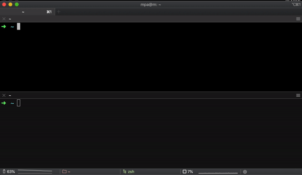

# lnx

a wrapper to start docker in your shell with your files *now*

## setup

    ln -s $(pwd)/lnx /usr/local/bin
    docker tag ubuntu:18.04 lnx

## usage

Files are mapped from your host and all state is persisted:

    $ cd myfolder
    myfolder $ pwd
    /Users/you/myfolder
    myfolder $ lnx
    root@lnx:~/myfolder# pwd
    /Users/you/myfolder
    root@lnx:~/myfolder# apt-get update && apt-get install -y htop
    root@lnx:~/myfolder# exit

Resume the session:

    myfolder $ lnx
    root@lnx:~/myfolder# htop

Snapshot your state:

    $ docker commit lnx lnx-with-htop

Restore the snapshot:

    $ docker tag lnx-with-htop lnx
    $ lnx
    root@lnx:/# htop
